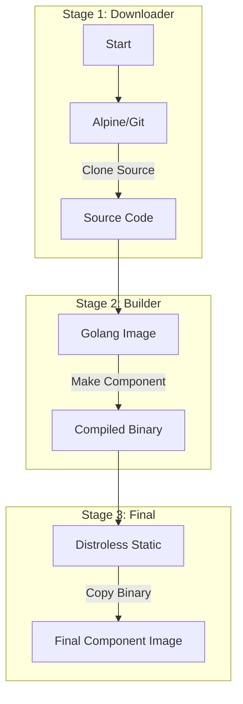

# Harbor Immutable Images

This directory contains the configuration and build instructions for creating all necessary Harbor component images from source.

## Component Description
Harbor is an open source trusted cloud native registry project that stores, signs, and scans content. Because Harbor is composed of multiple microservices, we build a separate immutable image for each component.

## Subfolder Contents

- **`core/`**: The main Harbor core service. Handles API, auth, and webhook events.
- **`jobservice/`**: The asynchronous job execution service (replication, scanning, etc.).
- **`portal/`**: The frontend web interface (built from Node.js source).
- **`registry/`**: The image registry (distribution) server.
- **`registryctl/`**: controller for registry, handling GC and other maintenance tasks.
- **`trivy-adapter/`**: Adapter service for the Trivy vulnerability scanner.
- **`exporter/`**: Prometheus exporter for Harbor metrics.
- **`nginx/`**: The reverse proxy serving as the entry point for Harbor.

## Build Flow (General)

Most backend components follow this flow:



*Note: The `portal` component uses a Node.js builder but follows the same pattern.*

## How to Build

All components share the version defined in `config.yaml`.

```bash
# 1. Get version
VERSION=$(grep 'version:' config.yaml | awk '{print $2}' | tr -d '"')

# 2. Build each component (example for core)
cd core
nerdctl build --build-arg VERSION=$VERSION -t harbor-core:$VERSION .

# Repeat for other folders:
# cd ../jobservice && nerdctl build ... -t harbor-jobservice:$VERSION .
# cd ../portal && nerdctl build ... -t harbor-portal:$VERSION .
# ...
```
