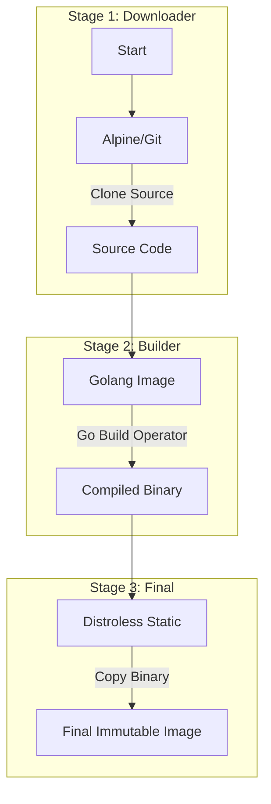

# Keptn Immutable Image

This directory contains the configuration and build instructions for creating an immutable Keptn container image from source.

## Component Description
Keptn is an event-based control plane for continuous delivery and automated operations. This build creates a minimal image for the Keptn Operator/Lifecycle Toolkit.

## Build Flow



## How to Build
This image is designed to be built using `nerdctl` and stored in the local containerd namespace.

1. **Check Version**: Ensure `config.yaml` specifies the desired version.
2. **Build Command**:
   ```bash
   # Extract version from config
   VERSION=$(grep 'version:' config.yaml | awk '{print $2}' | tr -d '"')
   
   # Build with nerdctl
   nerdctl build --build-arg VERSION=$VERSION -t keptn-operator:$VERSION .
   ```
